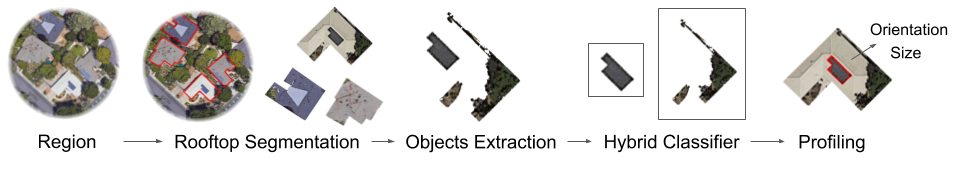

# SolarFinder: Automatic Detection of Solar Photovoltaic Arrays.

Smart cities, utilities, third-parties, and government agencies are having pressure on managing stochastic power generation from distributed rooftop solar photovoltaic arrays, such as accurately predicting and reacting to the variations in electric grid. Recently, there is a rising interest to identify and characterize solar PV arrays automatically and passively. Traditional approaches such as online assessment and utilities interconnection filings are time consuming and costly, and limited in geospatial resolution and thus do not scale up to every location. Significant recent work focuses on using aerial imagery to train machine learning or deep learning models to automatically detect solar PV arrays. Unfortunately, these approaches typically require Very High Resolution (VHR) images and human handcrafted image templates for training, which have a minimum cost of \$15 per $km^2$ and are not always available at every location.

To address the problem, we design a new system---"SolarFinder" that can automatically detect distributed solar photovoltaic arrays in a given geospatial region without any extra cost. SolarFinder first automatically fetches low/regular resolution satellite images within the region using publicly-available imagery APIs. Then, SolarFinder leverages multi-dimensional K-means algorithm to automatically segment solar arrays on rooftop images. Eventually, SolarFinder employs hybrid linear regression approach that integrates support vectors machine (SVMs-RBF) modeling with a deep convolutional neural network (CNNs) approach to accurately identify solar arrays and characterize each solar deployment simultaneously. We evaluate SolarFinder using 269,632 public satellite images that include 1,143,636 contours from 13 geospatial regions in U.S. We find that pre-trained SolarFinder yields a MCC of 0.17, which is 3 times better than the most recent pre-trained CNNs approach and is the same as a re-trained CNNs approach. 

<p align="center"> 

</p>

#### [Project Website](https://cps.cs.fiu.edu/projects/solarfinder-project/)

## Datasets

To download rooftop images data: [Download (TBA)](https://github.com/cyber-physical-systems/SolarFinder)
We currently have issue to host the linked website for sharing the dataset. A new link will be annouced soon.

## Pre-request Environment

### Environment Requirement

python3.7 or higher version is required.

### Setup Environment
1. Install virtual environment
```
pip install virtualenv
```

2. Create venv directory
```
python3 -m venv .venv
```

3. Activate virtual environment
```
source .venv/bin/activate
```

4. Install packages from requirements.txt
```
pip install -r requirements.txt
```

5. Deactivate virtual environment
```
deactivate
```

SolarFinder work is published at the 19th ACM/IEEE Conference on Information Processing in Sensor Networks (IPSN 2020).
If you use our code or datasets in your research, please consider to cite our work:

#### SolarFinder: Automatic Detection of Solar Photovoltaic Arrays.<br>
Qi Li, Yuzhou Feng, Yuyang Leng and Dong Chen.<br>
In Proc. of the 19th ACM/IEEE International Conference on Information Processing in Sensor Networks, IPSN'20, April 21-24, 2020, Sydney, Australia.

